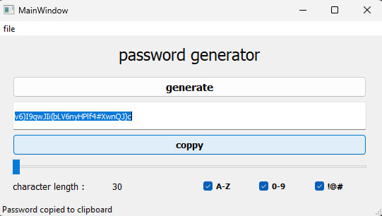

# 🔐 Password Generator (PyQt5 GUI)

A modern, stylish, and flexible password generator app with a simple PyQt5 interface.

---

## 🚀 Features

- Generate secure passwords with:
  - 🔤 Upper & lower-case letters (A-Z, a-z)
  - 🔢 Numbers (0–9)
  - 🔣 Special characters (!@#$%...)
- Adjustable password length (1–30)
- Real-time display of password length
- One-click copy to clipboard
- Error prompt if no character types are selected
- Simple and clean UI (Dark-friendly)

---

## 🖥 Screenshot



> You can replace this with your own screenshot saved at `images/screenshot.png`.

---

## 📦 Requirements

- Python 3.8+
- PyQt5

### Install dependencies:

```bash
pip install PyQt5
